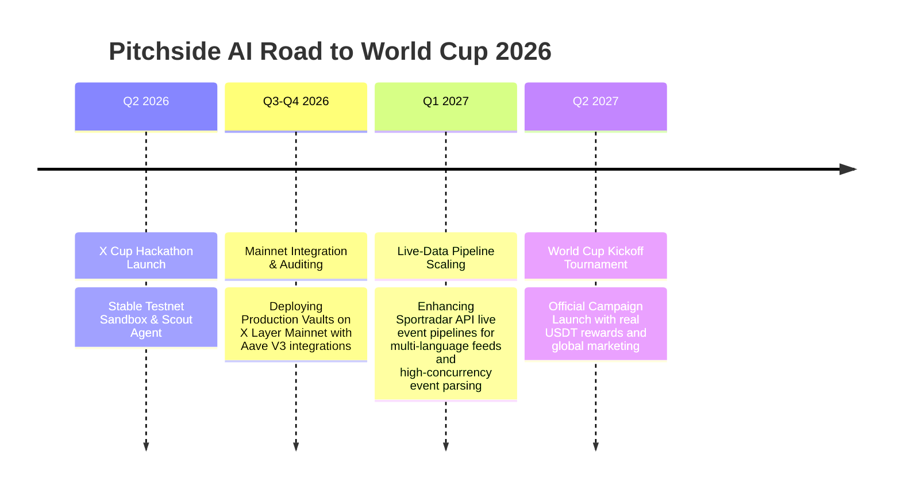

# Shield Suite & Pitchside AI - X Layer Security Infrastructure & Autonomous Speculation

> **The ultimate security-first DeFi infrastructure layer and no-loss World Cup speculation network on X Layer.**  
> Built for the **X Layer Build X Season 2 AI Hackathon** (Winner of 3rd Place) and expanded with **Pitchside AI (Autonomous World Cup Speculation Network)** for the **X Layer X Cup Hackathon (May 19 - May 28, 2026)**.

---

## 📖 Table of Contents
1. [🏆 Why Pitchside AI Wins (Judge Checklist)](#-why-pitchside-ai-wins-judge-checklist)
2. [🚨 The Problem & Our Solution](#-the-problem--our-solution)
3. [🏗️ Ecosystem Components](#-ecosystem-components)
4. [⚽ Pitchside AI - Autonomous World Cup Speculation](#-pitchside-ai--autonomous-world-cup-speculation)
5. [🤖 Autonomous AI Agent (TEE)](#-autonomous-ai-agent-tee)
6. [🔌 OnchainOS Integration Deep-Dive](#-onchainos-integration-deep-dive)
7. [💳 x402 Agent Economy](#-x402-agent-economy)
8. [🔧 Model Context Protocol (MCP)](#-model-context-protocol-mcp)
9. [🚀 Active Development & Road to World Cup 2026](#-active-development--road-to-world-cup-2026)
10. [⚓ Smart Contract Deployments](#-smart-contract-deployments)
11. [⚙️ Local Setup & Testing](#-local-setup--testing)
12. [🧐 Onchain Verification for Judges](#-onchain-verification-for-judges)
13. [🌐 Live Endpoints & Infrastructure](#-live-endpoints-and-infrastructure)

---

## Why Pitchside AI Wins

Pitchside AI goes far beyond a simple MVP prediction market. It implements state-of-the-art Web3 architectural paradigms:

*   **100% Principal Protection (Zero Loss Staking):** Staked USDT is not bet. Instead, on Mainnet, it is supplied directly to **Aave V3 Pools** using [ProductionNoLossVault.sol](contracts/contracts/ProductionNoLossVault.sol). The principal remains 100% safe, while virtual yield (Scout Credits) is generated for risk-free speculation.
*   **Hardware-Grade Agent Security (TEE):** The autonomous scout runs inside a secure **Trusted Execution Environment (TEE)** using the `okx-agentic-wallet` SDK. Private keys are securely sealed inside hardware enclaves and can never be extracted by the host application.
*   **OKX NFT Marketplace Indexing:** Dynamic Player Shares are minted as standardized ERC-1155 tokens onchain using [PlayerShares.sol](contracts/contracts/PlayerShares.sol). Standardized metadata is served dynamically via our API endpoint so that player index shares can be indexed, bought, and sold instantly on the **OKX NFT Marketplace**.
*   **Decentralized, Block-Derived Leaderboard:** Unlike centralized databases, our leaderboard inside [Leaderboard.tsx](packages/shieldswap/src/components/Leaderboard.tsx) queries the X Layer blockchain in real-time. It scans `Deposited` and `AgentDelegated` event logs to fetch active participants, calculate their pool share, and pull TVL and credits directly from the smart contract.
*   **Professional Live Data Pipeline:** Integrates **Sportradar Soccer API v4** for professional-grade live match data on Mainnet, with ESPN public scoreboard as a fallback. Live scores, match status, and player events feed directly into the TEE Scout Agent for autonomous trading.
*   **Security-First Aggregator:** ShieldSwap integrates `okx-dex-swap` to search 500+ DEX pools, but intercepts all swaps with ScanGuard MCP to warn users and block toxic token interactions before they hit the blockchain.

---

## The Problem & Our Solution

### The Problem
With the proliferation of L2 tokens and AI-driven trading, malicious actors deploy honeypots, hidden taxes, and toxic bytecode to drain liquidity. Centralized DEX routers execute swaps blindly, and AI agents lack a standard, machine-readable protocol to verify token safety natively before engaging. 

Furthermore, sports prediction and speculation markets are traditionally high-risk, causing retail users to lose their hard-earned principal on bad predictions.

### Our Solution: Shield Suite & Pitchside AI
We built a dual-layer security and speculation ecosystem:
1.  **For Humans:** **ShieldSwap**, the first security-gated DEX Aggregator. If you attempt to swap a malicious token, the aggregator visually blocks the transaction with an interactive threat report.
2.  **For World Cup Speculators:** **Pitchside AI** (new feature built on ShieldSwap), a no-loss speculation loop where users stake stablecoins, accumulate virtual credits (yield), and delegate them to secure AI agents to trade player shares risk-free.
3.  **For Machines:** **ScanGuard MCP**, a native Model Context Protocol server that implements the **x402 monetization standard**. AI agents can query this server to get instantaneous, programmatic token risk data.

---

## Ecosystem Components

The Shield Suite monorepo is divided into four highly integrated packages:

### 1. ScanGuard (`packages/scanguard`)
The brain of the operation. A Node.js backend serving as both a RESTful API and a standard **MCP Server**.
*   Executes **Dual-Layer Scanning**: Combines `okx-security` APIs with a custom bytecode heuristics engine.
*   Manages the **x402 Payment Loop**, requiring micro-payments for access to its intelligence.
*   Serves the **World Cup Match & News Feed** to drive the Pitchside speculation loop.

### 2. ShieldSwap & Pitchside AI (`packages/shieldswap`)
A glassmorphic, terminal-inspired frontend built in React/Vite.
*   Integrates `okx-dex-swap` to route trades across 500+ liquidity sources on X Layer, guaranteeing optimal routing.
*   Features a conversational **AI Agent Chatbot** seamlessly integrated directly into the trading UI, allowing users to scan tokens and stage trades using natural language.
*   Hosts **Pitchside AI** - an interactive portal featuring DeFi staking, player market speculation cards, and live TEE agent execution logs.

### 3. Agent Dashboard (`packages/dashboard`)
A real-time command center for monitoring the entire ecosystem.
*   Provides a live, WebSocket-style data stream of all tokens being actively scanned across the network.
*   Cryptographically tracks the live balances and onchain heartbeat activity of the autonomous scanning agent.

### 4. Autonomous Agent (`packages/agent`)
A TEE-isolated Node.js loop running the autonomous agent scripts.
*   Houses both the original ScanGuard cron monitoring agent and the new **Pitchside World Cup Scout Agent** [scout.ts](packages/agent/src/scout.ts).

---

## ⚽ Pitchside AI - Autonomous World Cup Speculation

**Pitchside AI** is a World Cup-themed expansion developed specifically for the **X Layer X Cup Hackathon**. It builds on top of Shield Suite's core security layers, adding no-loss staking and dynamic index token speculation:

```
                                 User Wallet
                                      │
                                      ▼
                            [NoLossVault.sol]
                       (Deposit stablecoin → Yield)
                                      │
                         (Delegates Scout Credits)
                                      │
                                      ▼
                             [Scout Agent (TEE)]
                          (Uses okx-agentic-wallet)
                                 │          │
                 (1. Scan token) │          │ (2. Swap shares)
                                 ▼          ▼
                          [ScanGuard MCP]  [PlayerDex.sol]
                                 │          │
                                 ▼          ▼
                          `okx-security`  [PlayerShares ERC-1155]
```

### The Substantial New Developments:
*   **`ProductionNoLossVault.sol` (Aave V3 Staking Vault):** On X Layer Mainnet, staked USDT is securely supplied to Aave V3 pools under the hood to generate real interest. Capital is 100% protected and withdrawable at any time. Accumulated interest is harvested to fund the reward prize pool.
*   **`PlayerShares.sol` (Dynamic Player Index):** An ERC-1155 contract representing synthetic player shares. Ratings and metadata update dynamically onchain. Serves standardized metadata JSON schemas for secondary trading integration on OKX NFT Marketplace.
*   **`PlayerDex.sol` (AMM Swap Engine):** A custom AMM enabling zero-slippage, credit-backed trading of Player Shares. Features decimal and yield rate synchronization ($10^{12}$ factor) to natively support both 6-decimal USDT and 18-decimal virtual credits.
*   **TEE Scout Agent (`scout.ts`):** Fetches match news, evaluates sports sentiment, validates bytecode safety via ScanGuard API, updates player ratings onchain, and executes swaps automatically.
*   **Dynamic Onchain Ratings & Pricing:** The TEE Scout Agent dynamically updates player ratings and statistics onchain (via `PlayerShares.updatePlayer(...)`) when it parses positive or negative news events. Since the share price in the `PlayerDex` AMM is calculated directly from the onchain rating, these match updates automatically shift player share valuations in real time, allowing early spec-buyers to cash out their profits.
*   **Dynamic Onchain Leaderboard:** A network-aware leaderboard component that queries the active blockchain (scanning Deposited and AgentDelegated contract events) to fetch users' credits and staked values in real time on both Testnet and Mainnet. Features a **2-week campaign system** with Pre-Season Warm-Up (testnet) and Season 1 Group Stage (mainnet) countdown timers.

---

## Autonomous AI Agent (TEE)

We have deployed an autonomous Node.js agent running 24/7. It continuously invokes the ScanGuard API to monitor the top 11 X Layer core tokens (WOKB, USDC, USDT, USDe, etc.) for emerging threats.

*   **Institutional Security:** Utilizes the `okx-agentic-wallet` backed by a **Trusted Execution Environment (TEE)**. The private key is strictly isolated and never exposed to the application runtime, rendering it immune to memory-dump attacks.
*   **Onchain Checkpoints:** Emits a literal `0 OKB` transaction on the X Layer ledger periodically. Attached to the transaction data is a UTF-8 encoded metadata string (`"ScanGuard Cycle Success"`), acting as an immutable public heartbeat proving the agent's uptime.

---

## OnchainOS Integration Deep-Dive

Our application deeply leverages the OKX OnchainOS ecosystem to provide routing, analytics, and wallet controls:

| SDK Module | Implementation Details |
|------------|------------------------|
| `okx-security` | Powers the core threat-detection engine (honeypots, taxes, proxy checks) for ScanGuard and agent safety checks. |
| `okx-dex-swap` | Used in our ShieldSwap frontend to generate highly optimized, low-slippage trade execution call data natively across all aggregated X Layer DEXs. |
| `okx-dex-token` | Provides real-time token metadata, market caps, token logo fetching, decimal standardization, and address validation. |
| `okx-agentic-wallet`| Secures the TEE Autonomous Scout's private key within a secure hardware enclave, enabling trustless delegation. |
| `okx-x402-payment` | Facilitates the cryptographic verification and conceptual architecture for streaming micropayments from client agents. |

---

## x402 Agent Economy

ScanGuard pioneers a monetized API standard for AI agents via [x402 Payment Required](https://www.x402.org):

1.  **Request:** An external AI agent calls `POST /api/scan` without authorization.
2.  **Denial:** Server returns `HTTP 402 Payment Required` with instructions to pay $0.005 USDC.
3.  **Payment:** The agent signs and broadcasts the stablecoin transaction natively on X Layer.
4.  **Verification:** The agent retries the request providing `X-402-Payment: <signed-receipt>`.
5.  **Fulfillment:** The server confirms the onchain transfer and returns the security report.

*(Note: In the live demo environment, the protocol operates in "LIVE Subsidized" mode to prevent endlessly draining the agent's real USDC funds over a continuous 24/7 uptime window, while openly logging the gross revenue metrics on the Dashboard).*

---

## Model Context Protocol (MCP)

ScanGuard exposes an HTTP MCP server that any standard AI client can query natively to give them "X Layer vision".

### Calling the MCP Tool natively via cURL
```bash
curl -X POST http://38.49.216.120:3402/mcp/tools/call \
  -H "Content-Type: application/json" \
  -d '{"name":"scan_token","arguments":{"tokenAddress":"0x779ded0c9e1022225f8e0630b35a9b54be713736"}}'
```

### Config Template
```json
{
  "mcpServers": {
    "scanguard": {
      "url": "http://38.49.216.120:3402/mcp",
      "description": "Native security scanning for ERC-20 tokens on X Layer"
    }
  }
}
```

---

## 🚀 Active Development & Road to World Cup 2026

ShieldSuite and Pitchside AI are not just hackathon submissions—they are actively maintained projects on a direct roadmap to mainnet deployment ahead of the **FIFA World Cup 2026**.

### 🗓️ Development Roadmap



### Key Areas of Active Development:
1. **Production-Grade Audit Readiness:** Auditing the AMM logic in [PlayerDex.sol](contracts/contracts/PlayerDex.sol) and the Aave-integrating No-Loss Vault to support large TVL pools.
2. **Multi-Agent Staking Systems:** Supporting multi-agent selection where users can delegate to custom AI personalities (e.g., Aggressive Scout, Defensive/Yield-Focused Scout) that run different sentiment analysis logic in independent secure TEE enclaves.
3. **Sportradar Core Live Pipeline:** Transitioning from the current ESPN public feed fallback to a fully redundant, enterprise-grade Sportradar socket integration to handle up to 64 live tournament matches simultaneously without rate-limit constraints.
4. **Enhanced Security Verification:** Integrating ScanGuard deep bytecode heuristics with active on-chain simulation checks so that agents evaluate risk based on current block-state before routing funds.

---

## ⚓ Smart Contract Deployments

### X Layer Mainnet (Chain ID 196) - Production Standby
*   **Real USDT (USDT0):** `0x779Ded0c9e1022225f8E0630b35a9b54bE713736`
*   **NoLossVault (Aave V3 Pool):** `0xe8a63b4a905d9c1c2262f261dee90478d6ffd3de`
*   **PlayerShares:** `0xb1cc05dc0a0b70fabc6bbb1b3043ba386c86d7e1`
*   **PlayerDex AMM:** `0xf2338b4ba18373070cdfd9f53da321fa12aa591b`
*   **TEE Agent Address:** `0xDAce8445a5bD576111cCC8e598B67965252023C2`

### X Layer Testnet (Chain ID 1952) - Sandbox Testing
*   **MockUSDT:** `0xe5E0795a8A61502409f304f391B615220d720fE9`
*   **NoLossVault:** `0x9E1A49480C1c1762A4B465F50c5cAAb86Aa3B046`
*   **PlayerShares:** `0xE8a63B4a905d9C1C2262F261dee90478d6fFD3De`
*   **PlayerDex AMM:** `0xF2338b4Ba18373070cDfD9F53DA321fA12Aa591b`
*   **TEE Agent Address:** `0xDAce8445a5bD576111cCC8e598B67965252023C2`

---

## Local Setup & Testing

### 1. Installation
```bash
npm install
```

### 2. Run Contract Test Suite
Verify that all staking, yield generation, and AMM trade constraints are fully functional:
```bash
cd contracts
npm run test
```

### 3. Spin Up the Local Ecosystem
```bash
npm run dev
```
This single command orchestrates:
*   The Backend / API (Port `3402`)
*   The ShieldSwap & Pitchside UI (Port `5175`)
*   The Ecosystem Dashboard (Port `5174`)
*   The Autonomous TEE Scout Agent

---

## Onchain Verification for Judges

To verify the completion and execution of the Pitchside AI World Cup loop:

1.  **Claim Faucet & Stake:** Connect your wallet, claim 1,000 Mock USDT from the Faucet, and stake USDT in the **No-Loss Vault**.
2.  **Delegate Agent:** Select the **Active TEE Scout Agent** and click **Confirm Delegation**.
3.  **Verify Live Data Feed:** Click **Verify Live Data Feed** in the Scout Console to verify real-time match data from Sportradar Soccer API v4. Live matches show with a pulsing red indicator.
4.  **Watch Agent React:** The Scout Console will immediately reflect the agent detecting new match events, scanning token bytecode via ScanGuard, and executing transactions on the `PlayerDex` contract.
5.  **Verify Explorer:** Copy the generated transaction hash and search it on [X Layer Testnet Explorer](https://www.okx.com/explorer/xlayer-test) to verify the TEE Agent called the swap on your behalf.
6.  **Check the Leaderboard:** The Global Scout Leaderboard shows your ranking, Scout Credits, staked amount, and pool share - all read directly from onchain contract events.

---

## Live Endpoints and Infrastructure

*   **Network:** X Layer Mainnet (`Chain ID 196`)
*   **ShieldSwap Application:** [https://shieldsuite.xyz/](https://shieldsuite.xyz/)
*   **ScanGuard Dashboard:** [https://dashboard.shieldsuite.xyz/](https://dashboard.shieldsuite.xyz/)
*   **Central API Node & MCP Host:** `railway`
*   **TEE Agent Identity (X Layer):** `0xDAce8445a5bD576111cCC8e598B67965252023C2`

---

## Contact & Socials

*   **Developer:** MrNetwork
*   **Email:** mrnetwork0001@gmail.com
*   **X (Twitter):** [@encrypt_wizard](https://x.com/encrypt_wizard)
