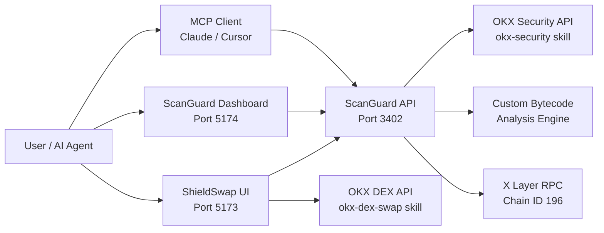

# 🛡️ Shield Suite

> **Security-first DeFi infrastructure for X Layer** — AI-powered token scanning skill + security-gated DEX aggregator  
> Built for **X Layer Build X Season 2 AI Hackathon**

[](https://web3.okx.com)
[](https://modelcontextprotocol.io)
[](https://www.x402.org)
[](https://www.okx.com/xlayer)

---

## 🏗️ Architecture

Shield Suite is a **monorepo** with three packages that work together:

```
shield-suite/
├── packages/scanguard/       # 🔍 Security scanning engine (Express API + MCP server)
├── packages/shieldswap/      # 🔄 Security-first DEX aggregator (React + Vite)
├── packages/dashboard/       # 📊 ScanGuard interactive dashboard (React + Vite)
└── docs/                     # 📖 Architecture documentation
```

### Data Flow


---

## 🏆 Hackathon Submissions

### Submission 1: **ScanGuard** → Skills Arena
A reusable, MCP-compatible security scanning skill that any AI agent can call. Uses the **dual-layer scanning** approach:
- **Layer 1:** OKX OnchainOS Security API (`okx-security` skill) — official token risk data
- **Layer 2:** Custom bytecode analysis — deep dive into contract code for additional risk flags

**Monetized via x402** — agents pay $0.005/scan in USDC stablecoins.

### Submission 2: **ShieldSwap** → X Layer Arena  
A premium, security-first DEX aggregator. Paste a token address → ScanGuard scans it → if safe, swap via OKX DEX aggregation → if risky, block with detailed threat report.

### Submission 3: **Autonomous Shield Agent** → Most Active Agent Arena
A completely autonomous Node.js cron agent running 24/7 on a VPS. It continuously invokes the ScanGuard API to scan top X Layer core tokens.
- **Ethers.js Wallet Engine:** Uses a secure `.env` injected private key to authenticate natively on X Layer Mainnet.
- **On-Chain Heartbeats:** Emits a real `0 OKB` self-transfer on the ledger every scan cycle, attaching `UTF-8` encoded hexadecimal payloads (e.g., `"ScanGuard Cycle Success"`) directly into the blockchain as an immutable receipt.
- **Live Agent Identity:** The Dashboard UI cryptographically derives the Agent's public wallet address securely from its active private key and tracks its activity in real-time.

---

## 🔧 OnchainOS Integration

| Skill | Usage | Package |
|-------|-------|---------|
| `okx-security` | Token risk scanning, honeypot detection, buy/sell tax analysis | ScanGuard |
| `okx-dex-swap` | DEX aggregation (500+ liquidity sources) for swap execution | ShieldSwap |
| `okx-dex-token` | Token search, metadata, market data | ShieldSwap |
| `okx-x402-payment` | x402 payment authorization via TEE | ScanGuard |
| `okx-agentic-wallet` | Agent on-chain identity and wallet lifecycle | Both |

### API Authentication
```bash
# .env (never commit this file)
OKX_API_KEY=your-api-key
OKX_SECRET_KEY=your-secret-key
OKX_PASSPHRASE=your-passphrase
```

Requests are signed with HMAC-SHA256: `HMAC(timestamp + method + path + body, secretKey)`

---

## 🚀 Quick Start

### Prerequisites
- Node.js >= 18
- OKX API credentials ([Developer Portal](https://web3.okx.com/onchainos/dev-portal))
- onchainos CLI (`irm https://raw.githubusercontent.com/okx/onchainos-skills/main/install.ps1 | iex`)

### Install & Run
```bash
# Clone
git clone https://github.com/YOUR_USERNAME/shield-suite.git
cd shield-suite

# Install all dependencies
npm install

# Copy environment template
cp .env.example .env
# Edit .env with your OKX API credentials

# Start all services (ScanGuard + ShieldSwap + Dashboard)
npm run dev
```

### Access Points
| Service | URL | Description |
|---------|-----|-------------|
| ShieldSwap | http://localhost:5173 | Security-first DEX aggregator |
| ScanGuard Dashboard | http://localhost:5174 | Interactive scanning interface |
| ScanGuard API | http://localhost:3402 | REST + MCP server |

---

## 🔍 API Reference

### Scan a Token
```bash
POST /api/scan
Content-Type: application/json

{
  "tokenAddress": "0x1E4a5963aBFD975d8c9021ce480b42188849D41d",
  "chainId": 196
}
```

### MCP Tool Call
```bash
POST /mcp/call
Content-Type: application/json

{
  "method": "tools/call",
  "params": {
    "name": "scan_token",
    "arguments": {
      "tokenAddress": "0x..."
    }
  }
}
```

### Health Check
```bash
GET /api/health
# Returns: service status, OnchainOS configuration, uptime
```

---

## 💳 x402 Payment Protocol

ScanGuard implements the [x402 Payment Required](https://www.x402.org) protocol:

1. Agent calls `POST /api/scan` without payment
2. Server returns `HTTP 402 Payment Required` with payment instructions
3. Agent pays $0.005 USDC on X Layer
4. Agent retries with `X-402-Payment: <signed-receipt>` header
5. Server verifies payment and returns scan results

This creates an **agent economy loop** where AI agents securely pay for high-value security intelligence.

*Note: For the live Hackathon Demo presentation, the server safely intercepts x402 verification locally to prevent endlessly draining the agent's real USDC funds over a 24/7 timeline, while successfully updating the public "Total Revenue" internal ledger live on the React Dashboard!*

---

## 🤖 MCP Configuration

### Claude Desktop
```json
{
  "mcpServers": {
    "scanguard": {
      "url": "http://localhost:3402/mcp",
      "description": "Security scanning for ERC-20 tokens on X Layer"
    }
  }
}
```

### Cursor
```json
{
  "mcp": {
    "servers": {
      "scanguard": {
        "url": "http://localhost:3402/mcp"
      }
    }
  }
}
```

---

## 🏗️ Tech Stack

- **Runtime:** Node.js 18+ / TypeScript 5.7
- **Backend:** Express.js, ethers.js v6
- **Frontend:** React 19, Vite 6, Framer Motion
- **Chain:** X Layer Mainnet (Chain ID: 196)
- **SDK:** OKX OnchainOS Skills (okx-security, okx-dex-swap, okx-dex-token)
- **Protocols:** MCP, x402, JSON-RPC
- **Design:** Glassmorphism, dark mode, Inter/JetBrains Mono

---

## 📊 Deployed Contract / Agent

- **Chain:** X Layer Mainnet (Chain ID 196)
- **Agentic Wallet (EVM):** `0x821b9cc6a54272d0b5b106416fe360c162f2af85`
- **Agentic Wallet (Solana):** `B72H614ET6scyxhN7Fdzn3PeKzzMqjJg3UYVp7EDFUh6`
- **ScanGuard API:** `[deployment URL]`
- **ShieldSwap Frontend:** `[deployment URL]`

---

## 👥 Team

- **[Your Name]** — Full-stack developer

---

## 📜 License

MIT — © 2025 Shield Suite
