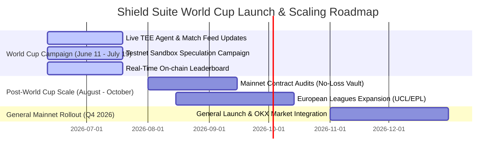

# 🛡️ Shield Suite & Pitchside AI: Development & Growth Proposal

## 1. Executive Summary

Shield Suite is a security-first DeFi infrastructure and autonomous speculation ecosystem built natively on X Layer. In the short time since its inception, the project has achieved remarkable milestones:
*   **X Layer Build X Season 2 AI Hackathon:** 3rd Place Winner (Original Security Suite & ScanGuard MCP).
*   **X Layer X Cup Hackathon:** 2nd Place Winner (Pitchside AI - Autonomous World Cup Speculation Network).

As a solo founder, I have designed, coded, and deployed the entire stack—ranging from Solidity smart contracts (AMM, zero-loss staking vault, ERC-1155 player indexes) to TEE-enclave agent loops, MCP servers, and the glassmorphic frontend. 

**Critical Context:** With the **FIFA World Cup starting this week (June 11, 2026)**, we are shifting from a long-term development schedule to an **immediate, live-action rollout**. This document outlines our immediate tournament campaign, followed by a transition plan to support major European football leagues and post-World Cup scaling. We seek **OKX Incubation** to support this live launch, provide mentorship, and help build a dedicated core team.

---

## 2. Product Development & Campaign Roadmap

To leverage the massive attention surrounding the World Cup starting this week, we are launching an immediate **Live Sandbox Campaign** during the tournament, followed by a professional security and audit phase to scale the platform long-term.

### Phase 1: Live World Cup Campaign (June 11 - July 19, 2026)
*   **Live Match Feed & TEE Scout Execution:** Starting June 11, our TEE Scout Agent ([scout.ts](packages/agent/src/scout.ts)) will go live tracking the official World Cup matches. It will autonomously ingest live scores, compute player sentiment, update player ratings on-chain, and execute swaps.
*   **Risk-Free Sandbox Campaign:** To protect user capital while contracts are pending formal audits, we will run a **Sandbox Speculation Campaign** on X Layer Testnet. Users stake Mock USDT, receive virtual credits, and delegate them to the TEE Agent.
*   **Real USDT Prize Pool:** We will distribute a real USDT reward pool (sponsored by partners/ecosystem) to the top performers on the on-chain leaderboard, creating a high-incentive, zero-risk onboarding funnel.
*   **Real-time Leaderboard:** The on-chain leaderboard will track performance and deposits in real-time, providing immediate visibility for active users.

### Phase 2: Post-Tournament Security & European Leagues Transition (August - October 2026)
*   **Smart Contract Auditing:** Transition the contracts (`ProductionNoLossVault.sol` and `PlayerDex.sol`) to formal external audits to prepare for uncapped mainnet TVL.
*   **European League Expansion:** Port the speculative AMM model from the World Cup to European League Football (UEFA Champions League, English Premier League, La Liga) starting in August 2026, maintaining the user momentum generated during the World Cup.
*   **Multi-Agent Vault Profiles:** Deploy multiple TEE-secured agent profiles allowing users to delegate to different strategies (e.g., *Aggressive Attacker Hunter*, *Defensive Value Finder*).

### Phase 3: General Mainnet Rollout (Q4 2026 and Beyond)
*   **Uncapped Mainnet Staking:** Launch the live staking vault on X Layer Mainnet integrating with Aave V3 pools to generate organic, low-risk yield.
*   **OKX NFT Marketplace Secondary Market:** Implement full metadata standardizations to allow player index shares to be traded directly as dynamic NFTs on the OKX NFT Marketplace.

---

## 3. Community & Growth Proposal (World Cup Push)

With the tournament starting this Thursday, June 11, our growth strategy is focused on high-frequency, event-driven engagement.

### Pillar 1: High-Frequency Twitter/X Content Loops
We will leverage live match events to drive social media visibility:
*   **Real-Time "Scout Logs":** Automatically post TEE Agent decisions on X immediately following key match events (e.g., *"Our TEE Agent just upgraded Bukayo Saka's rating to 89 and swapped 200 credits for his shares after his goal against Senegal"*).
*   **Daily Tournament Digests:** Share daily summaries of the top-performing players, the agent's net portfolio value, and the leading wallets on our leaderboard.
*   **ScanGuard Real-Time Alerts:** Run continuous automated security scans on newly deployed X Layer tokens, sharing instant safety reports to establish Shield Suite as the go-to security hub.

### Pillar 2: Gamified Staking Campaigns
*   **Matchday Challenges:** Offer "Credit Boosts" to users who delegate to the agent right before major matches (e.g., the opening match on June 11, group stage deciders, and the finals).
*   **Referral Multipliers:** Users who invite friends to stake in the sandbox vault receive a percentage match of their friends' accumulated credits, rapidly expanding the user base during the tournament.

### Pillar 3: Developer Relations & MCP Integrations
*   **Developer Sandbox:** Provide open access to ScanGuard's Model Context Protocol (MCP) server so that other builders launching AI agents during the World Cup can natively protect their agent wallets from malicious tokens.

---

## 4. OKX & X Layer Ecosystem Alignment

*   **Drives Active Accounts & Tx Volume:** The sandbox campaign will introduce new users to X Layer, prompting wallet creation, testnet gas interaction, and continuous transaction flow from the TEE Agent.
*   **OKX SDK Showcase:** We highlight the capabilities of OKX's suite by deeply integrating `okx-security`, `okx-dex-swap`, `okx-agentic-wallet`, and `okx-x402-payment` under live, real-world sporting conditions.

---

## 5. Team Expansion & Mentorship (Incubation Ask)

As a solo founder, I have proven I can build and launch a complex, winning prototype. To scale this into a production-grade Web3 consumer brand during and after the World Cup, I am seeking support from the **OKX Incubation Program** in these core areas:

### 1. Team Recruitment (Urgent)
I need to expand the team to support operations during the World Cup and prepare for Phase 2:
*   **Smart Contract Engineer (Part-time/Co-founder):** To oversee post-tournament contract optimization, Aave V3 mainnet integrations, and audit preparation.
*   **Growth & Marketing Lead (Part-time/Co-founder):** To run social media, coordinate influencer partnerships, write content, and organize the weekly speculative tournaments.
*   **UI/UX Designer (Contract):** To refine the terminal and dashboard layouts for mainstream users.

### 2. Mentorship & Strategic Advisory
*   **Security Validation:** Technical mentorship from OKX security teams to review our TEE enclave isolation, key-management, and contract math.
*   **Marketing & Ecosystem Support:** Support from OKX's media channels to amplify our World Cup campaign starting this week, driving initial users to the sandbox.
*   **Compliance Advisory:** Mentorship on the regulatory structure of no-loss vaults, yield-based credit economies, and synthetic sports assets.
